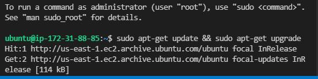
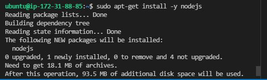
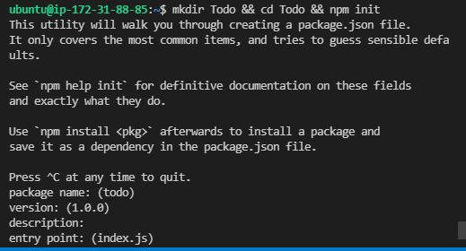
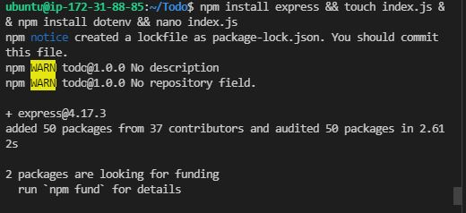
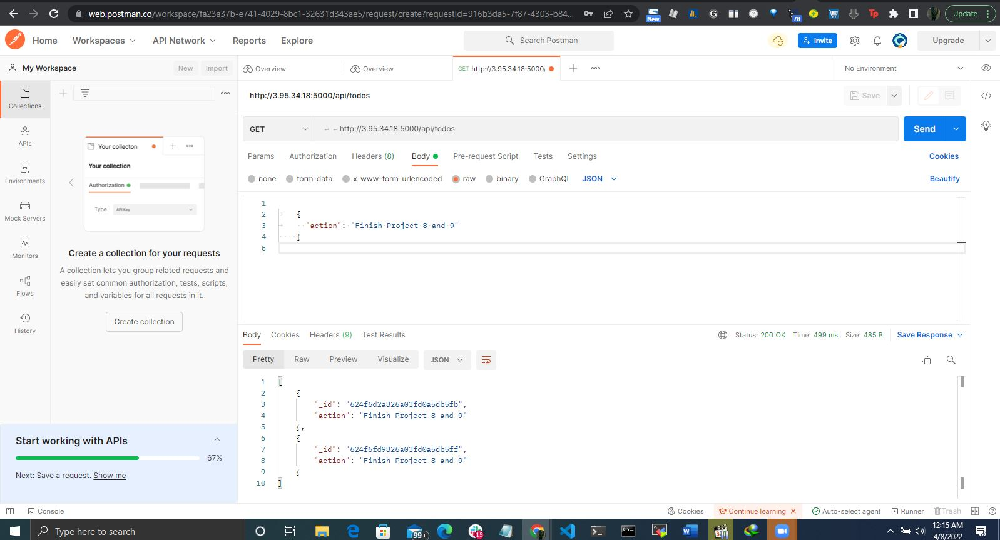
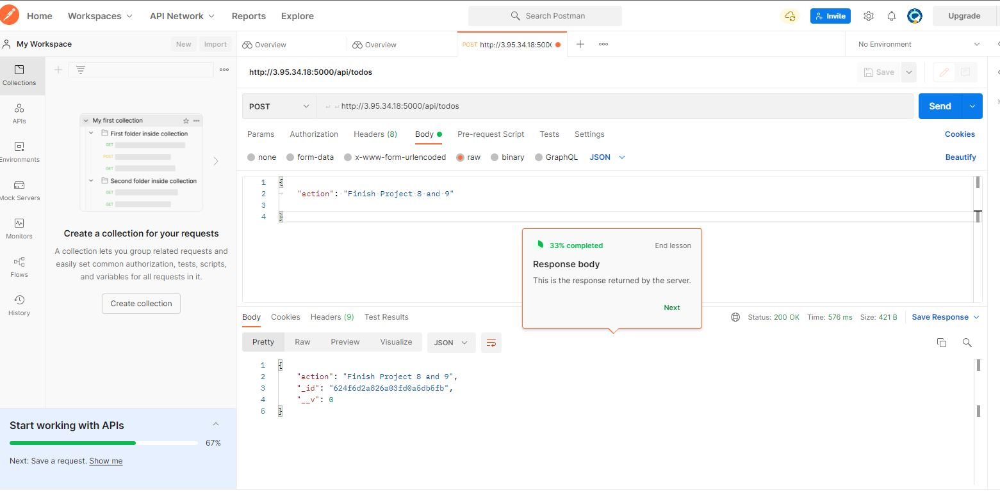
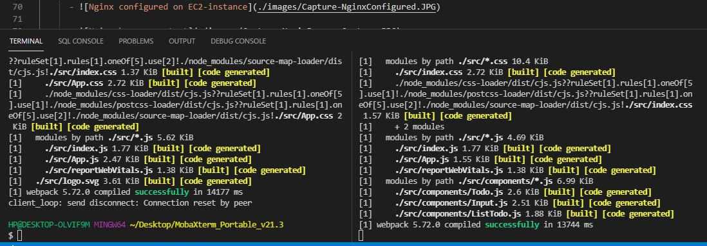
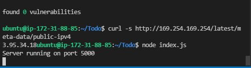
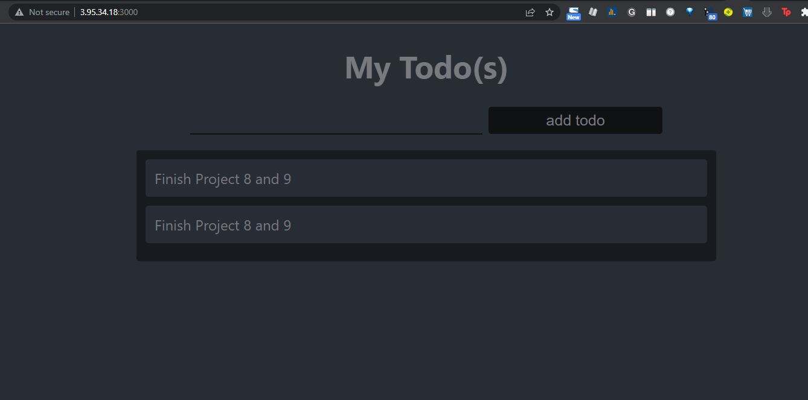

# Documentation for Project 3 - MERN-STACK on AWS
- Step 1 -- Setup Servers on AWS 
  
   - `sudo apt-get update && sudo apt-get upgrade` 
   
   -  
  
   -  
### Get the Node.js software and set it up 
   - `curl -sL http://deb.nodesource.com/setup_12.x | sudo -E bash -`
### Install Node.js on the server, the command below installs both npm and nodejs and verify that
     the installation was sucessful
   - ```
     sudo apt-get install -y nodejs
     node -v && npm -v 
     ```
   - 
### Create a directory for our application
### Switch into the directory above and initialise npm
   - `mkdir Todo && cd Todo && npm init`
   - 

### Next we install ExpressJS and create a file index.js, note we are still working in the directory To-do 
   - `npm install express && touch index.js && npm install dotenv && nano index.js`
   - 
### Copy the code below into index.js 

    ```
    const express = require('express');
    require('dotenv').config();

    const app = express();

    const port = process.env.PORT || 5000;
    app.use((req, res, next) => {
    res.header("Access-Control-Allow-Origin", "\*");
    res.header("Access-Control-Allow-Headers", "Origin, X-Requested-With, Content-Type, Accept");
    next();
    });

    app.use((req, res, next) => {
    res.send('Welcome to Express');
    });

    app.listen(port, () => {
    console.log(`Server running on port ${port}`)
    });

    ```
### Start server and verify it works, we also need to edit our security group and open port 5000 for Custom TCP

    `node index.js`

### Fetch server IP Address and DNS name
    `curl -s http://169.254.169.254/latest/meta-data/public-ipv4 `

    `http://169.254.169.254/latest/meta-data/public-hostname`

### We need to create routes for our applications to carry out three actions
  -- Create a new task
  -- Display list of tasks 
  -- Delete completed tasks 
### create a routes directory

    `mkdir routes && cd routes && touch api.js && nano api.js`
### Create Post and Get Requests on Postman
   - 
   -   

### Create React running and reset
   - 
   -   
### Live Project
   -  